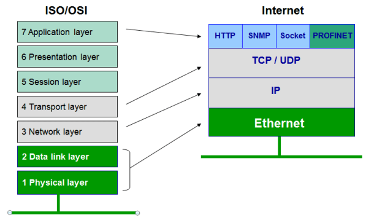
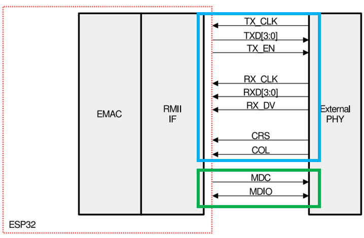
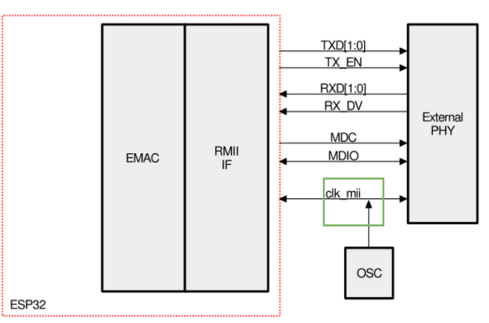
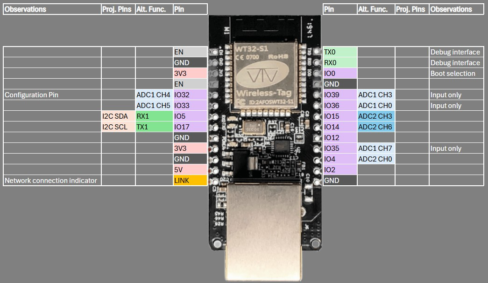

# Remote relay project

This project consists of the development of a remote actuation system for electrical loads and equipment, based on the WT32-ETH01 module. This module integrates an ESP32-S microcontroller with a LAN8720 Ethernet PHY, enabling wired network connectivity via the IEEE 802.3 standard.

The system interfaces with a TCA9555 digital I/O expander over an I²C bus, allowing scalable control of multiple digital outputs. Communication with a remote MQTT broker is handled over Ethernet, leveraging the lightweight publish/subscribe messaging protocol to ensure efficient and reliable data exchange in IoT applications.

Designed for deployment at the Pico dos Dias Observatory in Itajubá, Minas Gerais, Brazil, the system is intended to support remote automation tasks and infrastructure control in a scientific and industrial environment. The architecture is modular and scalable, making it suitable for various IoT and industrial automation scenarios requiring deterministic network performance and secure communication.

## Ethernet Phy

The image below demonstrates a comparissoin bewtweem the ISO/OSI Ethernet model and internet protocols, like HTTP:

The MAC (Media Access Controller) is usually integrated into a processor and controls the data-link-layer portion of the OSI model, and the data link layer defines the way in which communication takes place over the medium and the frame structure for the transmitted and received messages. 

The Ethernet Physical Layer (PHY) is the physical interface transceiver that implements the physical layer portion of the OSI model, its responsible for the physical link between the Ethernet controller and the network. The physical layer defines the electrical and optical signals, line status, clock reference, data encoding and circuits required for data transmission and reception, and communicates to the data link Layer devices provide standard interfaces.

The ESP32 already contains an Internal Ethernet Media Access Controller (MAC) and it can send and receive data by using an external ethernet PHY (physical layer), here comes the role of the LAN8720 which provides everything from the PHY to the RJ45 Connector in a small easy to use package.

The communication between MAC and PHY can have diverse choices:
- MII (Media Independent Interface).
- RMII (Reduced Media Independent Interface).

### MII (Media Independent Interface)
MII has two signal interfaces :
- A Data Interface : for sending and receiving Ethernet frame data.
- A PHY management interface (MDIO also known as SMI or MIIM): used to read and write the control and status registers of the PHY in order to configure each PHY before Operation, and to monitor link status during operation.
From the hardware point of view, the MIIM consists of the following two signals :
- MDC : Management Data clock that is driven by the MAC device to the PHY (25 MHz clock).
- MDIO data : Management Data Input/output, the PHY drives it to provide register data.

### RMII (Reduced Media Independent Interface)
RMII is the interface employed by WT32-ETH01 and LN8720, and it has the following features:
- Support for an operating rate of 10 Mbit/s or 100 Mbit/s.
- The reference clock frequency must be 50 MHz.
- The same reference clock must be provided externally both to the MAC and the external Ethernet PHY.
- It provides independent 2-bit-wide TX and RX data paths.

## WT32-ETH01 Ethernet hardware description

The WT32-ETH01 with LAN8720 contains an external 50 MHz and the **GPIO0** is the only choice to input the reference clock in the ESP32 to sincronize the MAC and PHY layers. But the **GPIO0** pin have an important role in selecting the Bootloader Mode as the ESP32 will enter the serial bootloader (programming mode) when **GPIO0** is held low on reset, otherwise it will run the program in flash.

Then, to solve this issue it is necessary to disable the reference clock in hardware by default and then re-enable it at the driver installation stage. This was done in WT32-ETH01 module using the Enable pin of the oscillator connected to **GPIO16** pin in the ESP32 to disable the oscillator at reset and then re-enable it when installing the driver.

- The interface to the Ethernet PHY uses **GPIO 23** for MDC and **GPIO 18** for MDIO.

- There's an external oscillator that drives **GPIO 0**, and that oscillator is enabled by setting **GPIO 16** high

- The PHY reset pin is NOT wired to a GPIO (it gets reset at startup)

## WT32-ETH01 Pinout

### Warning
There are limitations on several of the pins:
- **IO0:** At boot, must be pulled low to program, must float or be pulled high to boot normally. After booting, used to receive the Ethernet 50Mhz clock (enabled by IO16). Best to avoid any other use.

- **IO1:** ESP32 serial output. Used when programming and active by default when running. Best to avoid any other use.

- **IO2:** At boot, must float or be pulled low to program. You can use this pin (especially for output) but make sure nothing pulls it high while booting.

- **IO3:** ESP32 serial input. Used when programming and active by default when running. Best to avoid any other use.

- **IO5, IO15 (MTDO):** At boot, IO5 controls whether ESP32 libraries will print debug messages to the serial port (IO1). Also at boot, IO5 and IO15 together control timings of the module that lets the ESP32 act as an SD card. You are probably not using that module, so you can use these pins (especially for output) but note the effect on debug chatter if pulled while booting.

- **IO12 (MTDI):** At boot, must float or be pulled low or the chip won't work (wrong voltage). You can use this pin (especially for output) after booting, but make sure nothing pulls it high while booting.

- **IO35, IO36, IO39:** These pins are input only, but are otherwise free to use.

WiFi is internal to the ESP32 and works normally.

## References
 - https://github.com/Zelmoghazy/esp32-ethernet-lan8720/tree/main?tab=readme-ov-file
 - https://github.com/ldijkman/WT32-ETH01-LAN-8720-RJ45-
 - https://github.com/egnor/wt32-eth01

