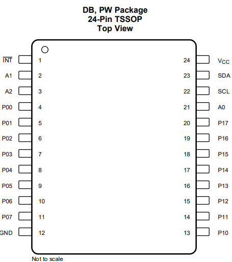

# 🔌 Remote Relay Project

This project involves the development of a **remote actuation system** for electrical loads and equipment, based on the **WT32-ETH01** module. This module integrates an **ESP32-S** microcontroller with a **LAN8720 Ethernet PHY**, enabling wired network connectivity through the IEEE 802.3 Ethernet standard.

The system interfaces with a **TCA9555 digital I/O expander** over an **I²C bus**, allowing scalable control of multiple digital outputs. Communication with a remote **MQTT broker** is carried out via Ethernet using the lightweight **publish/subscribe** messaging protocol, ideal for reliable and efficient data exchange in IoT environments.

📍 **Deployment Site**: Pico dos Dias Observatory, Itajubá, Minas Gerais, Brazil  
🔧 **Application**: Infrastructure automation and remote equipment control  
📡 **Technologies Used**: ESP32, LAN8720, MQTT, I²C, Ethernet, RMII

---

## 🌐 Ethernet PHY Overview

The diagram below shows a comparison between the **ISO/OSI Ethernet model** and common internet protocols such as HTTP:

The **MAC (Media Access Controller)** is embedded within the ESP32 and operates at the **Data Link Layer**, while the **PHY (Physical Layer Transceiver)** is responsible for electrical signaling and physical connection. The PHY communicates with the MAC through a standard interface.

Supported MAC/PHY communication interfaces:

- **MII** – Media Independent Interface  
- **RMII** – Reduced Media Independent Interface ← _used in this project_

---

### ⚡ MII – Media Independent Interface

The MII comprises two components:

- **Data Interface** – Transfers Ethernet frames  
- **PHY Management Interface (MDIO/MIIM)** – Handles configuration and monitoring

#### Key Signals

- `MDC`: Management Data Clock (driven by MAC)  
- `MDIO`: Management Data Input/Output (bi-directional)

---

### ⚡ RMII – Reduced Media Independent Interface

The **RMII interface** is utilized by the **WT32-ETH01** and **LAN8720**. Its advantages include:

- ✅ Supports both **10 Mbps** and **100 Mbps** operation  
- ✅ Requires only a **50 MHz reference clock**  
- ✅ Clock is shared between MAC and PHY  
- ✅ Transmit and receive data over **independent 2-bit** paths

---

## 🔧 WT32-ETH01 Ethernet Hardware

The **WT32-ETH01** module, paired with the **LAN8720 PHY**, includes a dedicated **50 MHz oscillator**. This clock signal is fed into the ESP32 via **GPIO0** to synchronize MAC and PHY operations.

However, **GPIO0** is also involved in **boot mode selection**:

- Held **low** on reset → enters **programming mode**  
- Held **high** or left floating → enters **normal boot**

> ⚠️ **Conflict Management**  
> To prevent boot mode conflicts, the oscillator is **disabled at reset** via **GPIO16**, and later re-enabled by software once the device has booted.

### 🖥️ LAN8720 GPIO Pin Summary

| Function           | GPIO Pin | Description                                      |
|--------------------|----------|--------------------------------------------------|
| MDC                | GPIO23   | Management Data Clock                            |
| MDIO               | GPIO18   | Management Data I/O                              |
| Clock Input        | GPIO0    | Receives 50 MHz oscillator signal                |
| Oscillator Enable  | GPIO16   | Enables oscillator after boot                    |
| PHY Reset          | —        | Automatic reset at startup (no GPIO required)    |

---

## 🖥️ WT32-ETH01 Pinout

---

## ⚠️ ESP32 Boot-Related GPIO Restrictions

> These pins affect the **ESP32 boot process**. Improper usage can prevent boot or lead to unstable behavior.

| GPIO  | Restriction Summary |
|-------|----------------------|
| **GPIO0** | Must be LOW to enter programming mode. Used for 50 MHz clock. Avoid reusing. |
| **GPIO1** | UART TX (programming). Avoid reusing. |
| **GPIO2** | Must be LOW or floating at boot. Usable after boot. |
| **GPIO3** | UART RX (programming). Avoid reusing. |
| **GPIO5, 15** | Affects debug/SD interfaces. Use with caution. |
| **GPIO12** | Must be LOW/floating to avoid voltage regulator issues. |
| **GPIO35, 36, 39** | Input-only. Suitable for sensing applications. |

✅ **Wi-Fi functionality** remains fully operational and is unaffected.

---

## 📌 Project-Specific Pinout

- **GPIO5** → TCA9555 I²C Serial Data (SDA)  
- **GPIO17** → TCA9555 I²C Serial Clock (SCL)

---

## 🔧 TCA9555 Overview

The **TCA9555** is a **16-bit I/O expander** operating on a bidirectional **I²C** bus (1.65V–5.5V). Each I/O can be configured as input or output via control registers. It also supports polarity inversion and configurable input/output data storage.

### 📌 TCA9555 Pinout

| Pin | Function |
|-----|----------|
| 1   | **INT** – Interrupt output (connect to VCC with pull-up) |
| 2, 3, 21 | **A1, A2, A0** – I²C address selection (tie to VCC or GND) |
| 22  | **SCL** – Serial clock (pull-up required) |
| 23  | **SDA** – Serial data (pull-up required) |
| 24  | **VCC** – Supply voltage |
| 12  | **GND** – Ground |
| 4–11, 13–20 | **P00–P17** – Push-pull I/O pins (default: input) |

---

### 📘 Register Map

##### Registers 0 and 1 (Input Port Registers) 
The Input Port registers (registers 0 and 1) reflect the incoming logic levels of the pins, regardless of whether the pin is defined as an input or an output by the Configuration register. It only acts on read operation. Writes to these registers have no effect. The default value, X, is determined by the externally applied logic level. 

<table border="1" cellpadding="5" cellspacing="0"> <tr> <th>Bit</th> <th>I0.7</th><th>I0.6</th><th>I0.5</th><th>I0.4</th> <th>I0.3</th><th>I0.2</th><th>I0.1</th><th>I0.0</th> </tr> <tr> <td>Default</td> <td>X</td><td>X</td><td>X</td><td>X</td> <td>X</td><td>X</td><td>X</td><td>X</td> </tr> <tr> <th>Bit</th> <th>I1.7</th><th>I1.6</th><th>I1.5</th><th>I1.4</th> <th>I1.3</th><th>I1.2</th><th>I1.1</th><th>I1.0</th> </tr> <tr> <td>Default</td> <td>X</td><td>X</td><td>X</td><td>X</td> <td>X</td><td>X</td><td>X</td><td>X</td> </tr> </table> 

##### Registers 2 and 3 (Output Port Registers) 
The Output Port registers (registers 2 and 3) show the outgoing logic levels of the pins defined as outputs by the Configuration register. Bit values in this register have no effect on pins defined as inputs. In turn, reads from this register reflect the value that is in the flip-flop controlling the output selection, not the actual pin value. 

<table border="1" cellpadding="5" cellspacing="0"> <tr> <th>Bit</th> <th>O0.7</th><th>O0.6</th><th>O0.5</th><th>O0.4</th> <th>O0.3</th><th>O0.2</th><th>O0.1</th><th>O0.0</th> </tr> <tr> <td>Default</td> <td>1</td><td>1</td><td>1</td><td>1</td> <td>1</td><td>1</td><td>1</td><td>1</td> </tr> <tr> <th>Bit</th> <th>O1.7</th><th>O1.6</th><th>O1.5</th><th>O1.4</th> <th>O1.3</th><th>O1.2</th><th>O1.1</th><th>O1.0</th> </tr> <tr> <td>Default</td> <td>1</td><td>1</td><td>1</td><td>1</td> <td>1</td><td>1</td><td>1</td><td>1</td> </tr> </table> 

##### Registers 4 and 5 (Polarity Inversion Registers) 
The Polarity Inversion registers (registers 4 and 5) allow polarity inversion of pins defined as inputs by the Configuration register. If a bit in this register is set (written with 1), the corresponding port pin's polarity is inverted. If a bit in this register is cleared (written with a 0), the corresponding port pin's original polarity is retained. 

<table border="1" cellpadding="5" cellspacing="0"> <tr> <th>Bit</th> <th>N0.7</th><th>N0.6</th><th>N0.5</th><th>N0.4</th> <th>N0.3</th><th>N0.2</th><th>N0.1</th><th>N0.0</th> </tr> <tr> <td>Default</td> <td>0</td><td>0</td><td>0</td><td>0</td> <td>0</td><td>0</td><td>0</td><td>0</td> </tr> <tr> <th>Bit</th> <th>N1.7</th><th>N1.6</th><th>N1.5</th><th>N1.4</th> <th>N1.3</th><th>N1.2</th><th>N1.1</th><th>N1.0</th> </tr> <tr> <td>Default</td> <td>0</td><td>0</td><td>0</td><td>0</td> <td>0</td><td>0</td><td>0</td><td>0</td> </tr> </table> 

##### Registers 6 and 7 (Configuration Registers) 

The Configuration registers (registers 6 and 7) configure the directions of the I/O pins. If a bit in this register is **set to 1**, the corresponding port pin is **enabled as an input** with a high-impedance output driver. If a bit in this register is **cleared to 0**, the corresponding port pin is **enabled as an output**. 

<table border="1" cellpadding="5" cellspacing="0"> <tr> <th>Bit</th> <th>C0.7</th><th>C0.6</th><th>C0.5</th><th>C0.4</th> <th>C0.3</th><th>C0.2</th><th>C0.1</th><th>C0.0</th> </tr> <tr> <td>Default</td> <td>1</td><td>1</td><td>1</td><td>1</td> <td>1</td><td>1</td><td>1</td><td>1</td> </tr> <tr> <th>Bit</th> <th>C1.7</th><th>C1.6</th><th>C1.5</th><th>C1.4</th> <th>C1.3</th><th>C1.2</th><th>C1.1</th><th>C1.0</th> </tr> <tr> <td>Default</td> <td>1</td><td>1</td><td>1</td><td>1</td> <td>1</td><td>1</td><td>1</td><td>1</td> </tr> </table>

---

## 📚 References

- 🔗 [esp32-ethernet-lan8720 – Zelmoghazy](https://github.com/Zelmoghazy/esp32-ethernet-lan8720)  
- 🔗 [WT32-ETH01-LAN-8720-RJ45 – ldijkman](https://github.com/ldijkman/WT32-ETH01-LAN-8720-RJ45-)  
- 🔗 [wt32-eth01 – egnor](https://github.com/egnor/wt32-eth01)

---

## 📌 License

[MIT License](./LICENSE)
This project is open-source. Please check the [LICENSE](./LICENSE) file for more information.